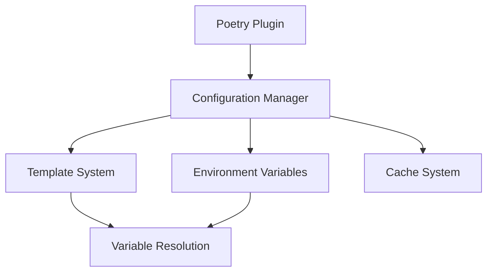

# API Reference

## Overview

The Pepperpy Poetry Plugin provides a robust API for managing shared configurations across Poetry projects. The API is organized into several components:

### Configuration System

The configuration system is the core of the plugin, providing:

- **Configuration Management**: Load and parse `pepperpy.toml` files
- **Template System**: Define and inherit configuration templates
- **Variable Resolution**: Support for environment and template variables
- **Caching**: Smart caching system for better performance

### Main Components

- [Configuration](config.md): Core configuration classes and functionality
- [Plugin](plugin.md): Poetry plugin implementation and integration

## Architecture

The plugin follows a modular architecture:



### Key Features

1. **Configuration Management**
   - Recursive file lookup
   - TOML parsing and validation
   - Configuration merging

2. **Template System**
   - Template inheritance
   - Variable substitution
   - Override capability

3. **Environment Variables**
   - Required/optional variables
   - Default values
   - Secret handling
   - Variable descriptions

4. **Caching System**
   - TTL-based caching
   - Size-limited cache
   - Cache invalidation
   - Performance optimization

## Usage Example

Here's a simple example of using the plugin programmatically:

```python
from pepperpy_poetry.config import PepperpyConfig
from pathlib import Path

# Load configuration
config_path = Path("pepperpy.toml")
config_dict = toml.load(config_path)
config = PepperpyConfig(config_dict)

# Validate configuration
errors = config.validate()
if errors:
    print("Configuration errors:", errors)
    exit(1)

# Get merged configuration with template
merged_config = config.get_merged_config("base")

# Access environment variables
for name, env_var in config.env_vars.items():
    print(f"{name}: {env_var.description}")
```

## Best Practices

1. **Template Usage**
   - Create base templates for common configurations
   - Use template inheritance for specialization
   - Keep templates focused and modular

2. **Environment Variables**
   - Mark sensitive data as `secret`
   - Provide clear descriptions
   - Use default values when appropriate

3. **Cache Configuration**
   - Adjust TTL based on update frequency
   - Set appropriate cache size limits
   - Monitor cache performance

4. **Configuration Structure**
   - Keep configurations organized
   - Use meaningful section names
   - Document configuration options 